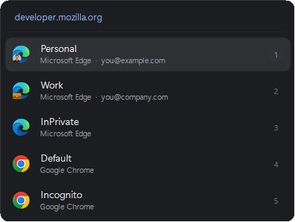
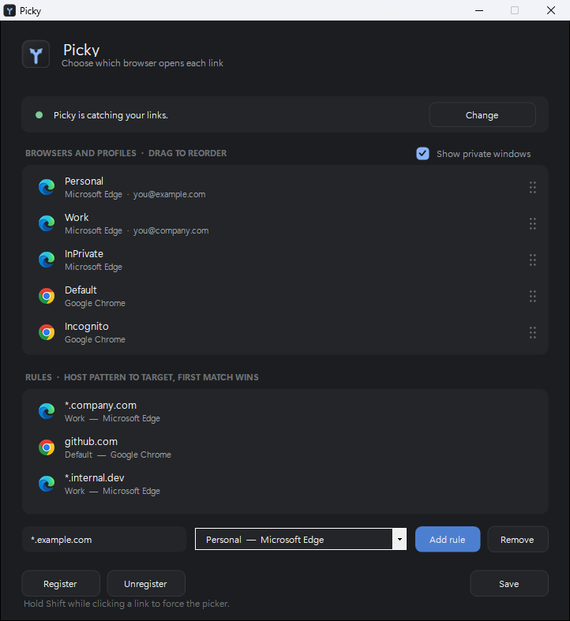

<p align="center">
  
</p>

<h1 align="center">Picky</h1>

<p align="center">
  <strong>Choose which browser opens each link.</strong><br>
  A Choosy-style browser chooser for Windows — in a single 85&nbsp;KB executable.
</p>

<p align="center">
  
</p>

<p align="center">
  
  
  
  
</p>

---

Windows lets you pick **one** default browser. Picky replaces that single choice
with a decision made per link: it registers itself as a browser, so Windows hands
it every link you click, and it either routes the link silently using a rule or
shows a picker at your cursor.

Click a work link, it opens in your work profile. Click anything else, you choose.

## Features

- **Per-profile targets** — Chrome and Edge profiles are separate destinations, not just "Chrome"
- **Real profile logos** — each entry uses the badged icon the browser itself puts on your taskbar
- **Rules** — host patterns route silently, so the links you always know about never interrupt you
- **Picker** — appears at the cursor; click, or press `1`–`9`
- **Shaped to taste** — a list or a dock, five sizes, and switches for names, addresses and private windows
- **Reorderable** — drag a logo in the live preview; that order becomes the number-key order
- **Self-updating** — settings checks Releases and installs a new version on click
- **Keyboard-first** — arrows and `Enter`, `Esc` to cancel, `Shift` while clicking to force the picker
- **Instant, and light between clicks** — a hidden copy answers each click in ~50 ms; between clicks it uses no CPU and hands its memory back. No tray icon
- **No installer, no dependencies** — one exe, ~85 KB

## Screenshots

<p align="center">
  
</p>

The preview in the middle is the real picker, drawn by the same code that draws
the menu itself — so it cannot show you something a link would not.

## Install

Download `picky.exe` from [Releases](../../releases), or build from source:

```powershell
.\install.ps1
```

That builds, installs to `%LOCALAPPDATA%\Picky`, registers, adds a Start Menu
shortcut, and starts Picky in the background. Install to a stable location rather than registering a build output —
the registration stores an absolute path, so moving or deleting the exe later
breaks link handling system-wide.

If you downloaded the exe instead, put it somewhere permanent, then:

1. Run `picky.exe` — the settings window opens
2. Click **Setup** — writes to `HKCU` only, no administrator rights needed
3. Click **Default** and assign **http** and **https** to Picky

That button is the one word at the top right, and it tells you where you are:
**Setup** before registering, **Default** once registered, **Change** once Picky
is handling your links.

That last step is manual by design. Windows protects the default-browser setting
with a per-user hash specifically so that no program can reassign it silently.
Any tool that claims to do it for you is forging that hash, and Windows reverts it.

## Updates

Opening settings checks the [Releases](../../releases) page in the background. When
a release is newer than the running build, a bar appears under the title with an
**Update** button: it downloads that release's `picky.exe`, moves the running one
aside, swaps the new one in and restarts. **Check for updates**, beside the
status word at the top, asks again at any time.

The repository is pinned in the source rather than read from config — an updater
that can be pointed elsewhere by a settings file is a way to make Picky run
someone else's code. A release is only offered if it is not a draft or a
prerelease and has a `picky.exe` attached, and the download is rejected unless it
is really a program.

## Usage

| Action | Result |
|---|---|
| Click a link | A matching rule routes it silently; otherwise the picker appears |
| `1` – `9` | Open in that entry — the keys work even where the numbers are not drawn |
| `↑` `↓` then `Enter` | Move the selection and open |
| `Esc`, or click away | Dismiss without opening |
| **Shift** while clicking a link | Force the picker even when a rule matches |

### Rules

Rules match the **hostname**, first match wins. Add them in the settings window,
or edit `%APPDATA%\Picky\config.json`:

```json
{
  "Rules": [
    { "Pattern": "*.company.com", "TargetId": "microsoftedge|Profile 1" },
    { "Pattern": "github.com",    "TargetId": "googlechrome|Default" }
  ],
  "Order": ["microsoftedge|Default", "microsoftedge|Profile 1"],
  "ShowPrivate": true,
  "PickerLayout": "column",
  "ShowLabels": true,
  "ShowHost": true,
  "ShowBrowserName": true,
  "PickerScale": 1.0
}
```

Key names are matched exactly, so keep the capitalisation above — it is what the
settings window writes. Everything below `ShowPrivate` is appearance: `PickerLayout`
is `"column"` or `"row"`, the three switches drop the profile name, the link
address and the browser name, and `PickerScale` sizes the whole menu (clamped to
0.5–2.0, since a zero would leave nothing to click).

Patterns are case-insensitive and anchored, so `github.com` does **not** match
`evil-github.com`. `*` is the only wildcard. A rule pointing at a browser or
profile that no longer exists falls through to the picker rather than silently
doing nothing.

## How it works

"Default browser" on Windows means a program registered as the handler for the
`http` and `https` protocols. Nothing requires that program to be a browser.

Picky registers itself as one, so its handler command is simply:

```
"picky.exe" "%1"
```

Windows launches it with the URL as an argument. It resolves your browsers and
profiles, applies your rules, shows the picker if needed, and launches the real
browser.

### Staying fast

A fresh .NET process spends most of a click loading WinForms and GDI+ and
compiling code before it can draw anything. So one copy of Picky stays running,
started with Windows (registering adds it to Startup apps, where it can be
switched off). A click still launches `picky.exe`, but when that copy is running
the new process only hands the URL over and exits. It never loads WinForms, so
the picker is up in about 50 ms.

Between clicks the running copy has no timers and nothing to do, so it uses no
CPU, and once the picker closes it returns its memory to Windows, which leaves a
few MB. Browsers, profiles and settings are re-read on every link, so nothing
it shows is stale. If it is not running, opening Picky or the next click starts it.

### Profile detection

Chromium profiles are read from `<User Data>\Local State` → `profile.info_cache`.
The display label is the first non-empty of `shortcut_name`, `gaia_name`, `name`,
then the directory key.

That order matters. `shortcut_name` holds the real label you see in the browser
("Personal", "Work"), while `name` is frequently a meaningless `Profile N` that
**disagrees with the directory it lives in** — a profile in the `Default`
directory routinely reports `name: "Profile 1"`. Tools that read `name` show a
scrambled list. Launch arguments always use the directory key, never the label.

Supported: Edge, Chrome, Brave, Vivaldi (profiles plus private mode), and Firefox
(default plus private).

## Debugging

- `picky.exe --keep <url>` — show the picker without dismissing it on focus loss; runs on its own, beside any background copy
- `picky.exe --background` — start the background copy without showing anything
- `picky.exe --demo` — placeholder profiles and sample rules; never writes config
- Unhandled errors append to `%APPDATA%\Picky\error.log`

## License

MIT
